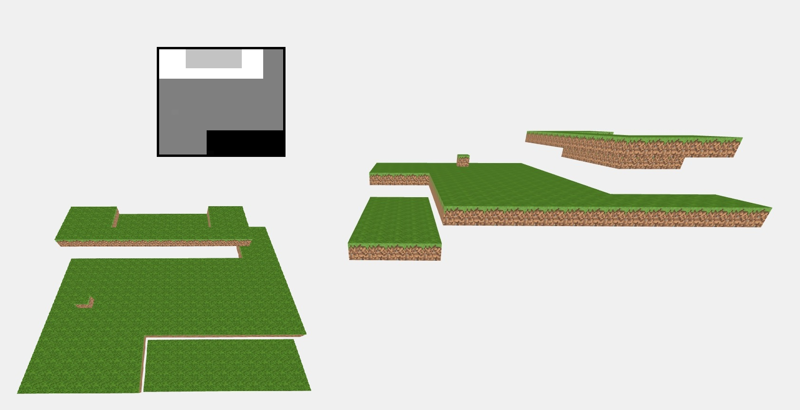
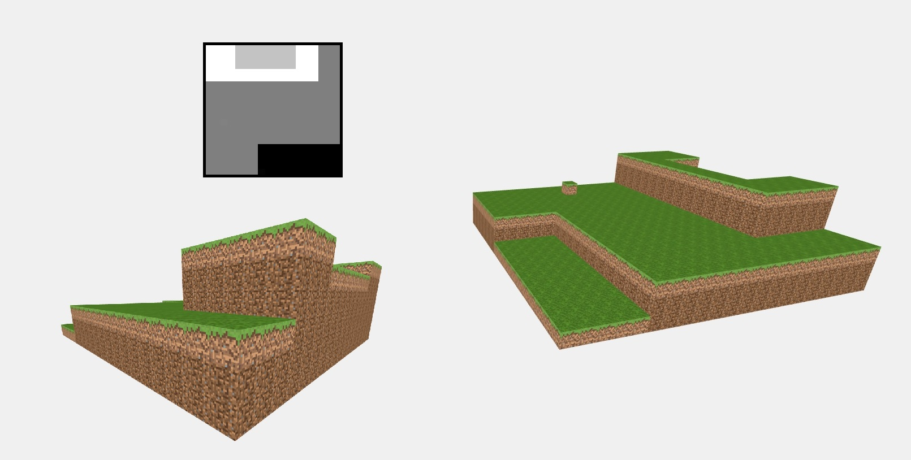

# Relazione per il primo progettino
Autori : Enrico Dal Ben, Haki Dine

## Parte I : Creazione di un terreno basato su heightmap
Autore : Enrico Dal Ben

### Studio e modifica del codice iniziale
Partendo dal codice iniziale fornito dal Professor Ranon nel file StartingCode-nolights.html ho creato un cubo di base con la texture inspirata ai cubi di Minecraft.
Per creare il cubo ho caricato 6 texture su un vettore e poi ho generato il materiale con cui ricoprire il cubo.
```javascript
  	var material1 = new THREE.MeshBasicMaterial( { map: new THREE.TextureLoader().load('textures/border.jpg') } );
	var material2 = new THREE.MeshBasicMaterial( { map: new THREE.TextureLoader().load('textures/border.jpg') } );
	var material3 = new THREE.MeshBasicMaterial( { map: new THREE.TextureLoader().load('textures/grass.jpg') } );
	var material4 = new THREE.MeshBasicMaterial( { map: new THREE.TextureLoader().load('textures/dirt.jpg') } );
	var material5 = new THREE.MeshBasicMaterial( { map: new THREE.TextureLoader().load('textures/border.jpg') } );
	var material6 = new THREE.MeshBasicMaterial( { map: new THREE.TextureLoader().load('textures/border.jpg') } );
  
	var materials = [material1, material2, material3, material4, material5, material6];
	var meshGrassMaterial = new THREE.MultiMaterial( materials );
```
Utilizzando il codice presente nel file StartingCode-heightmap.html ho capito come calcolare il colore di un pixel in una heightmap e come ritornare un vettore contenente i dati sulla tonalità di grigio utilizzando la funzione *getHeightData(img)*.


### Sviluppo heigthmap
Partendo dal cubo iniziale, con texture applicata, ho creato inizialmente un ciclo che clonava l'oggetto e poi lo spostava nella posizione corretta creando così un terreno piatto.
Sviluppando ulteriormente questa funzione in una funzione chiamata *CreateTerrain(width, height, data)* ho aggiunto i cubi e combinando il risultato fornito da *getHeightData(img)* sull'immagine, ho modificato la loro coordinata y per adattarla al colore del pixel : più chiaro è il pixel più in alto si troverà il cubo.\*



Il risultato del metodo *CreateTerrain(width, height, data)* sembra soddisfacente solo ne caso in cui la differenza di altezza da un cubo a un altro si di una unità e quindi non si generino spazi vuoti.
Per risolvere questo problema ho modificato il codice di *CreateTerrain* aggiungendo un ciclo che, utilizzando le coordinate di quel punto, generi tutti i cubi fino al piano che ha coordinate **(x, 0, z)**.\*
Questi cubi, però, non sono uguali a quelli generati sopra ma bensi sono dei cubi formati solo dalla texture *dirt.jpg*.
Per realizzare questo progetto ho preso spunto da Minecraft poichè offre ottimi spunti per il lavoro con cubi e texture applicabili a essi.
Il risultato dello sviluppo è il file *Grounds-filled.html*.



#### Osservazioni
Ho riscontrato che la funzione *getHeightData(img)* non sempre ritorna lo stesso risultatato per tutti i pixels dello stesso colore, come si può vedere nelle due immagine soprastanti, nononstante mi sia accertato che siano esattamente della stessa tonalità.
Controllando anche le variabili con lo strumento di ispezione di Google Chrome ho potuto notare che nel vettore che contiene le tre componenti dei colori che formano la sfumatura, una risulta diversa dalle altre dello stesso colore, inspiegabilmente.

### Sviluppo modello
Come modello mi sono inspirato ancora una volta a Minecraft per la creazione di un leone prendendo spunto dal lupo.
Ho scelto di ricadere su un leone per differenziarmi un po' dal gioco originale.
Al modello è stato aggiunto il movimento della coda./*
Infine il modello così creato è stato aggiunto alla scena con la heightmap e posto al centro.
Volendo si può anche posizionare in posti random, ma per evitare di doverlo rimpicciolire troppo ho deciso di posizionarlo al centro.
l'aggiunta del modello alla heigthmap si trova nel file *Ground-model.html*.

####
\* per i dettagli implementativi si rimanda al codice allegato

## Parte II : Movimenti di camera 
Autore : Hake Dine

### Parte iniziale 
Dopo aver concluso la parte del "Create Terrain" dovevo fare dei movimenti di camera con three.js, inquadrando sempre il terreno creato dal mio collega. Per fare ciò, ho fatto uso degli attributi position e lookat della varibile camera, che è una Perspective Camera.
  
```javascript
  	camera = new THREE.PerspectiveCamera( 75, window.innerWidth / window.innerHeight, 0.1, 1000 );
```
Per prima cosa, ho salvato il valore del tempo in cui iniziano le animazioni in una variabile chiamata "timestart". Questo è reso possibile dalla funzione "Date.now()". Successivamente ho creato una funzione chiamata "CameraChanges(Date.now())" in cui passo il tempo che scorre, e che ho posizionato nella funzione 
"Update()" già creata dal proffessor Ranon. In questa funzione userò condizioni "if()" nelle quali userò di nuovo la funzione "Date.now()",che mi da il tempo che sta trascorrendo, alla quale sottraggo la variabile "timestart". In questo modo  posso dettare i tempi di quando cambio i movimenti della camera.

```javascript
	var timestart=Date.now();
```	
```javascript	
	function Update() {
			requestAnimationFrame( Update );
			CameraChanges(Date.now());
			stats.update();
			Render();
	}
```
```javascript	
	function CameraChanges(Date){
		if(Date-timestart<3000){
			............
			............
		}
```

### Applicare movimenti di camera

Per quanto riguarda le proprietà position delle coordinate x,y e z , ho usato dei coefficenti mx,my e mz che usavo come misura di spostamento in positivo o in negativo. 
Quest'ultimi gli ho moltiplicati per dei numeri costanti diversi ogni volta: più grande è il numero costante, più veloce avviene la transizione della camera.  
La proprietà lookAt invece, l'ho usata ad ogni cambiamento di positione della camera in modo da dire alla camera virtuale di puntare sempre nello stesso punto, che in questo caso è l'origine.
 
```javascript
	var mx=0.002,my=0.003,mz=0.001;
```	
```javascript	
	camera.position.x += mx*24;
	
	camera.position.y -= my*40;
	
	camera.position.z -= mz*100;
	
	camera.lookAt( new THREE.Vector3(0,0,0));
```

Per i cambi totali di inquadratura ho usato sempre gli attributi position, ma ho applicato delle condizioni su una variabile chiamata shots. Questa varabile parte da valore 0, e ad
ogni cambio di inquadratura totale si incrementa di uno. Dentro alle condizioni riposiziono la camera e incremento shots. 
 
```javascript
	var shots=0;
```	
```javascript	
	if(Date-timestart>=24000 && Date-timestart<30000){
		if(shots==0){
			camera.position.x = -5;
			camera.position.y = 30;
			camera.position.z = 30;
			shots+=1;		
		}	
		camera.position.x += mx*50;
		camera.lookAt( new THREE.Vector3(0,0,0));
	}
```

